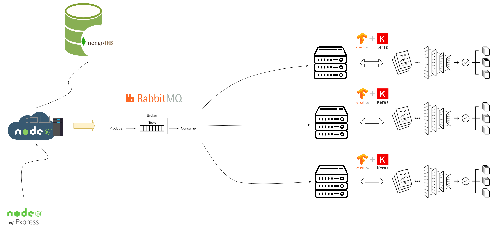
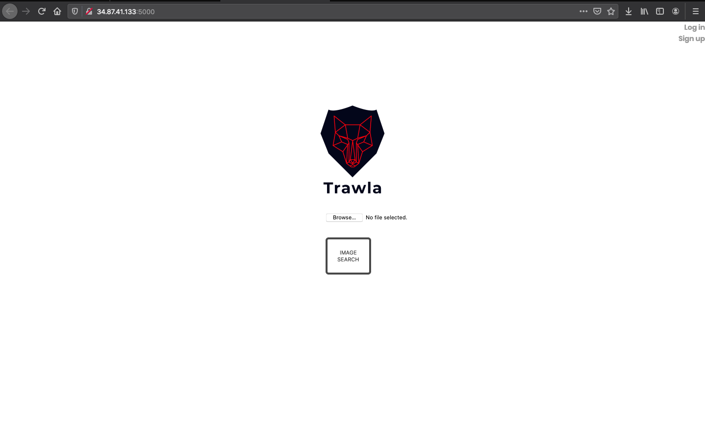
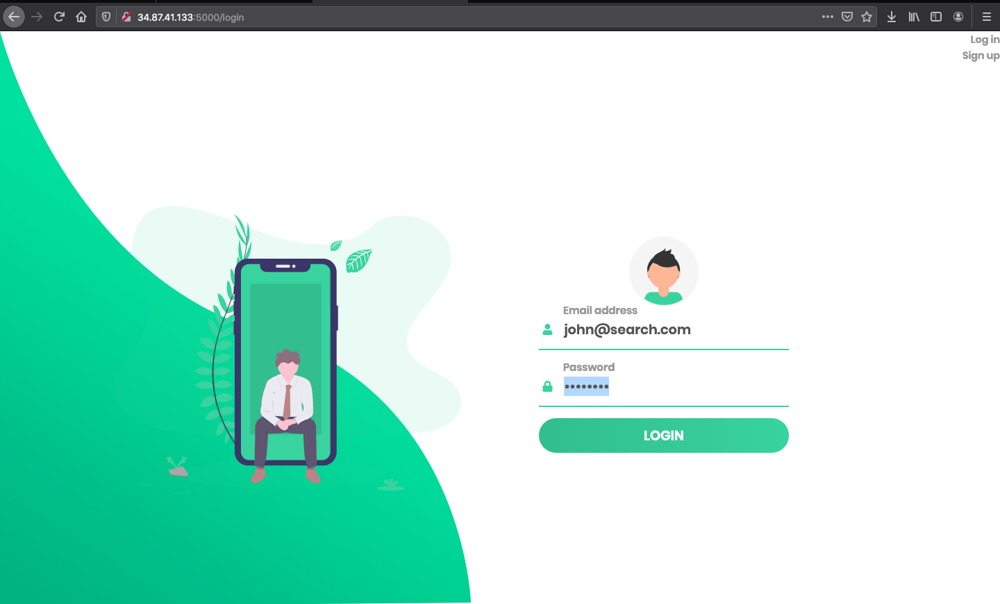
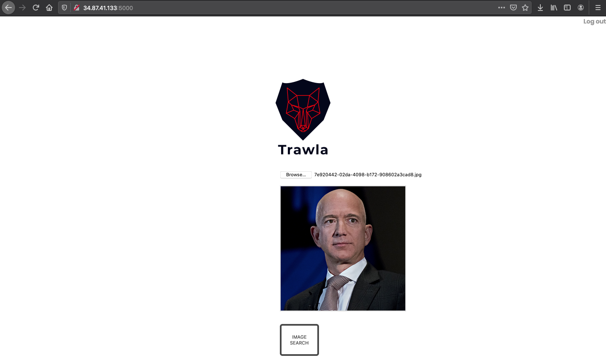
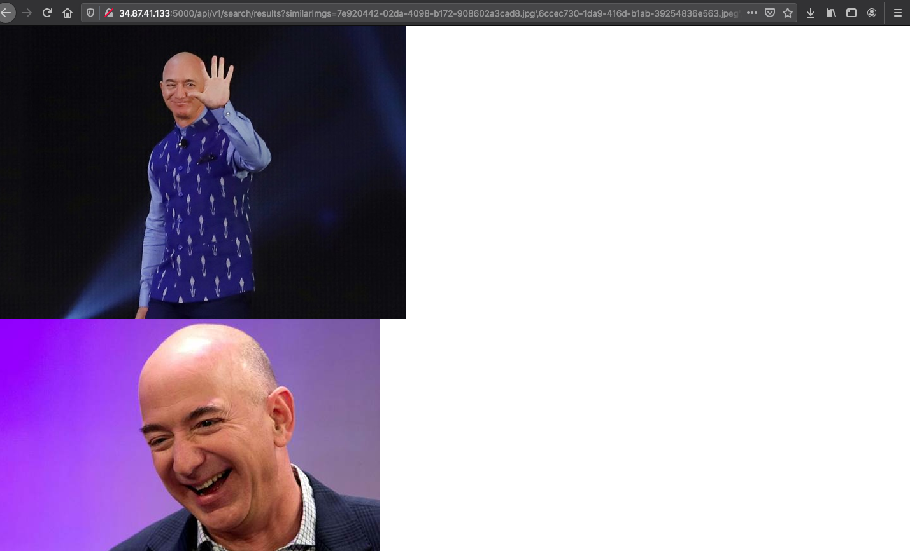

# Image Search using FaceNet

This project retrieves similar images when given a query image using a convolutional neural network(FaceNet) and exposes it as an API using an ExpressJS server.

## Overview Diagram



## Getting Started

These instructions will get you a copy of the project up and running on your local machine for development and testing purposes. See deployment for notes on how to deploy the project on a live system.

### Prerequisites

- [Docker](https://www.docker.com/products/docker-desktop)

### Top-level Directory Layout

```bash
.
├── overview.png
├── README.md
├── docker-compose.yml
├── k8s
├── search
├── search_node
└── search_node
```

### Installing

A step by step series of examples that tell you how to get a development env running

- `git clone https://github.com/leoan96/image-search.git`
- `docker-compose up`
- `Go to your browser and type localhost:5000`

## Deployment

Additional notes about how to deploy this on a live system using Google Cloud Platform and Kubernetes

- `Sign in to Google Cloud Platform console`
- `Go to the Compute section and click on Kubernetes Engine`
- `Create Cluster`
- `Connect to the newly created cluster by clicking connect on the cluster dashboard`
- `kubectl create secret generic jwt \ --from-literal JWT_SECRET=3493edf6b95140d2e4037b63c6c8cab91db2c3e47110bbc8f5b8b3feb2c9ef36 \ --from-literal JWT_EXPIRES_IN=3d \ --from-literal JWT_COOKIE_EXPIRES_IN=3`
- `Connect to the kubernetes cluster using the google Cloud SDK`
- `type kubectl apply -f k8s`

- [Demo Website](http://34.87.41.133:5000/) - Will be taken down soon due to running out of google cloud credits

## Valid Images

The search currently only works for 5 person:

- Mark Zuckerberg
- Fan Bingbing
- Jeff Bezos
- Taylor Swift
- Barack Obama

## Screenshots







## Built With

- [ExpressJS](https://expressjs.com/) - Minimal and flexible Node.js web application framework
- [MongoDB](https://www.mongodb.com/) - Stores user data
- [Mongoose](https://mongoosejs.com/) - MongoDB validation, casting and business logic
- [RabbitMQ](https://www.rabbitmq.com/) - Enables the search module to be scaled horizontally
- [Keras](https://keras.io/) - Provides face inference and retrieves similar images of query image
- [Kubernetes](https://kubernetes.io/) - Automated container deployment, scaling, and management

## Authors

- **Loh Mun Kit** - _Initial work_ - [leoan96](https://github.com/leoan96)

## License

This project is licensed under the MIT License

## Acknowledgments

Hat tip to anyone whose code was used

- https://github.com/davidsandberg/facenet
- https://www.fabriziovanmarciano.com/button-styles/
- https://machinelearningmastery.com/how-to-develop-a-face-recognition-system-using-facenet-in-keras-and-an-svm-classifier/
- https://www.freelogodesign.org/

## Disclaimer

- Image results may not return accurate faces.
- Referred codes from many online sources (Still a beginner).
- Please inform me to include any people or resources left out from the acknowledgments (I will try my best to correct the mistake).
- The image search only works for images that contain only a single face (using images without the faces of the person listed in the Valid Images section would crash the server).
- Currently to add additional faces for image retrieval, the images would have to be added manually each to both search/imgs and search_node/public/imgs (an alternate method i think would be better is to create another express server to host the images as an API service).
- .env files should not be included to github commits.
- UI design for the results page not completed.
